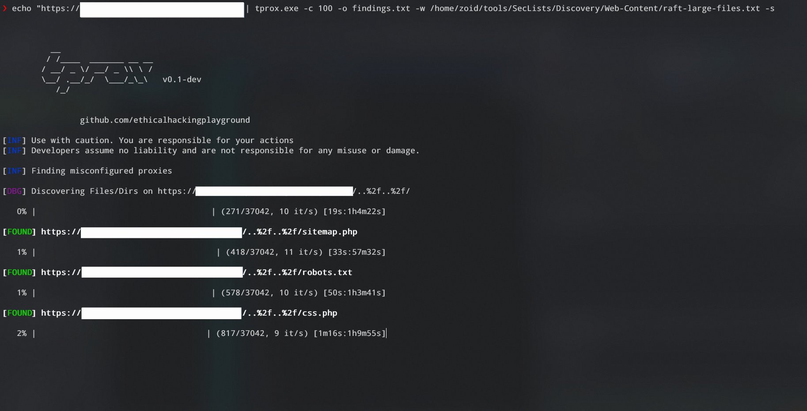

<h1 align="center">
  <br>

</h1>

<h4 align="center">TProx is a fast reverse proxy path traversal detector and directory bruteforcer</h4>

<p align="center">
  <a href="#install">Install</a> •
  <a href="#usage">Usage</a> •
  <a href="#examples">Examples</a> •
  <a href="https://discord.gg/MQWCem5b">Join Discord</a> 
</p>

---

### Install Options

#### From Source

```sh
▶  GO111MODULE=on go get -v  github.com/ethicalhackingplayground/tprox/tprox
```

#### Docker

```sh
▶  git clone https://github.com/ethicalhackingplayground/tprox && cd tprox && docker build -t tprox .
```

### Usage

```sh
▶ tprox -h
```

```sh
▶  docker run tprox -h
```

This will display help for the tool. Here are all the switches it supports.

<details>
<summary> 👉 tprox help menu 👈</summary>

```
Usage of tprox:
  -c int
        The number of concurrent requests (default 10)
  -crawl
        crawl the resolved domain while testing for proxy misconfigs
  -depth int
        The crawl depth (default 5)
  -o string
        Output the results to a file
  -regex string
        Filter crawl with regex pattern
  -s    Show Silent output
  -scope string
        Specify a scope to crawl in with a regex
  -w string
        The wordlist to use against a valid endpoint to traverse
```

</details>

### Examples

```sh
▶ echo "https://example.com/api/v1" | tprox -w wordlist
```

```sh
▶ echo "https://example.com" | tprox -w wordlist -crawl
```

```sh
▶ echo "https://example.com" | tprox -w wordlist -crawl -regex "/api/"
```

```sh
▶ echo "https://example.com" | tprox -w wordlist -crawl -regex "/api/" -scope ".*.\.example.com"
```

```sh
▶ cat urls.txt | tprox -w wordlist
```


<h1 align="center">
  <br>

</h1>

### Known Fixes

if for some reason the program fails to install or update run:

```sh
sudo rm -r /home/<user-name>/go/pkg/mod/github.com/ethicalhackingplayground/tprox
go clean --modcache
go clean
```

Then try and install it again.

### License

Tprox is distributed under [MIT License](https://github.com/ethicalhackingplayground/tprox/blob/main/LICENSE)

<h1 align="left">
  <a href="https://discord.gg/MQWCem5b"></a>
</h1>
```
